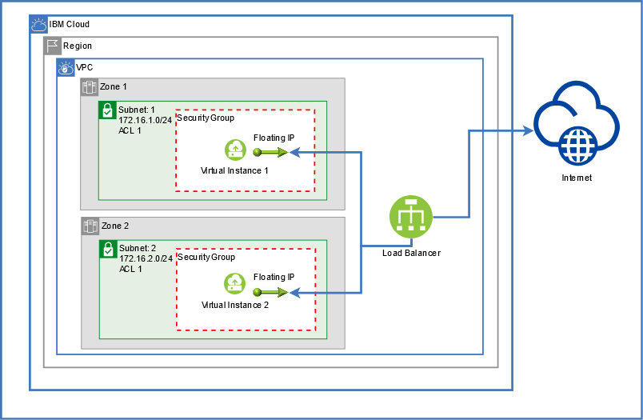

## Introduction

IBM Cloud Schematics delivers Terraform-as-a-Service so that you can use a high-level scripting language to model the resources that you want in your IBM Cloud environment, and enable Infrastructure as Code (IaC). Terraform is an Open Source software that is developed by HashiCorp that enables predictable and consistent resource provisioning to rapidly build complex, multi-tier cloud environments.

**What is Infrastructure as Code?**
Infrastructure as Code (IaC) helps you codify your cloud environment so that you can automate the provisioning and management of your resources in the cloud. Rather than manually provisioning and configuring infrastructure resources or using scripts to adjust your cloud environment, you use a high-level scripting language to specify your resource and its configuration. Then, you use tools like Terraform to provision the resource in the cloud by leveraging its API. Your infrastructure code is treated the same way as your app code so that you can apply DevOps core practices such as version control, testing, and continuous monitoring.

**How is IBM Cloud Schematics different from Terraform?**
With IBM Cloud Schematics, you can organize your IBM Cloud resources across environments by using workspaces. Every workspace is connected to a GitHub repository that contains a set of Terraform configuration files, which build a Terraform template. You can choose to create your own Terraform template, or use one of the pre-defined templates that are provided by IBM. Workspaces allow for the separation of concerns for cloud resources and can be individually managed with IBM Cloud Identity and Access Management. To use IBM Cloud Schematics, you don't need to install the Terraform CLI or the IBM Cloud Provider plug-in for Terraform. 

This Tutorial will introduce you to the concepts within Schematics and how to create a VPC, set up 2 zones each with a subnet, and place a virtual instance in each Zone as well as deploy a load balancer attached to the servers. A simple cloud-init script will install nginx, just to showcase an http response for proving out the Tutorial.

