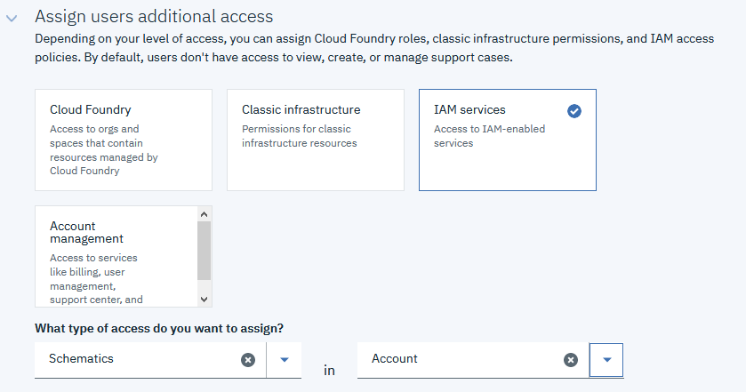

## Prerequisites

1. You must have an IBM Cloud account. You can sign up for a trial account if you do not have an account. The account will require the IBMid. If you do not have an IBMid, register and one will be created.

2. You will need to have an Infrastructure Username and API Key as well as an IBM Cloud API Key. Additionally, you should have the IBM Cloud CLI installed.

3. Check to make certain you have the appropriate role access on your account to provision infrastructure. If you are assigned an IBM Cloud Schematics service access role, you can view, create, update, or delete workspaces in IBM Cloud Schematics. To provision the IBM Cloud resources that you defined in your Terraform template, you must be assigned the IAM platform or service access role that is required to provision the individual resource. Refer to the [documentation](https://cloud.ibm.com/docs/home/alldocs) for your resource to determine the access policies that you need to provision and work with your resource. To successfully provision IBM Cloud resources, users must have access to a paid IBM Cloud account. Charges incur when you create the resources in the IBM Cloud account, which is initiated by clicking the Apply plan button. Here's a link to the docs for [Schematics Access](https://cloud.ibm.com/docs/schematics?topic=schematics-access).

4. In this Tutorial we will be using the following resources:
- Schematics
- VPC Infrastructure

5. An SSH Key will be required to create the virtual instances. You will need to populate the ssh_key_name variable with the name of a VPC SSH Key that you have already created for the region in which you plan to use. Use this [Example Public Key](example.pubkey). If you use the example key, you will not be able authenticate to the instances, but the lab will still function.

`ssh-rsa AAAAB3NzaC1yc2EAAAADAQABAAABAQDaccf9VZFmYGGDfzA0i/83+wUQ/PEMhQVQWAkwfX4+P+WEIuIjx1QW2BNzqJT6fPOZ0q7O8y663fIKc6pbvPLnad0bY75YNPR/xgfLOTJyD0MO2rosGYH3wTeCXl08Q9jqRWYbOLmxAle4aq27I66z+FCQfJhzBrD5AYUztmdpxoDNvhysaDdJj9/hFDlL7fM+flb17Zo9FAjMdV2BjhIm4MyaPsKg0dmGZM5t8v94AdBO2YpbdyOFMPbr68C3m95jDNOYbwDR4WUWqzJEtfs+oxPaTsmPBWcveXB58wCcEQVqX9/aAy73sA28UpVLhSkU2yaP7HEA0Bo44Cr0Beqb`

6. If you want to modify the variables for Image and Compute Profile, you will need to obtain these values from the CLI.
For Gen2 resource interaction via the CLI, you are required to have the infrastructure-services plugin.

`ibmcloud plugin install infrastructure-service`

This Tutorial will be using Gen 2 of the VPC. Set your CLI to target Gen2.

`ibmcloud is target --gen 2`

List the available images, and record the ID of the image in which you wish to use. Ubuntu 18.04 is set by default.

`ibmcloud is images list`

List the available Compute profiles and record the Name of the profile in which you wish to use. cx2-2x4 is set by default.

`ibmcloud is instance-profiles`

6. If you choose to do the optional steps at the end of the Tutorial, you must fork the project into your own repo so that you can make the required modifications and push back into your repo. If you choose to not do the additional steps, or do not have a Github account available, you can just use the Tutorial Git url, but will not have the ability to modify any of the plan. All modifications will only be done via the variables available.
