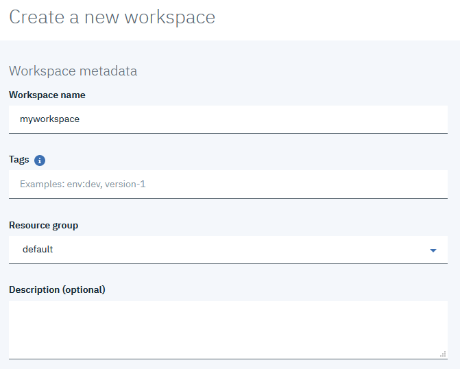
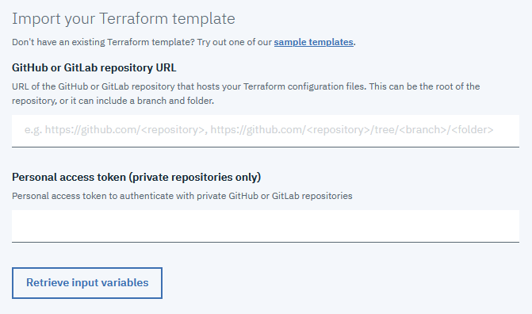
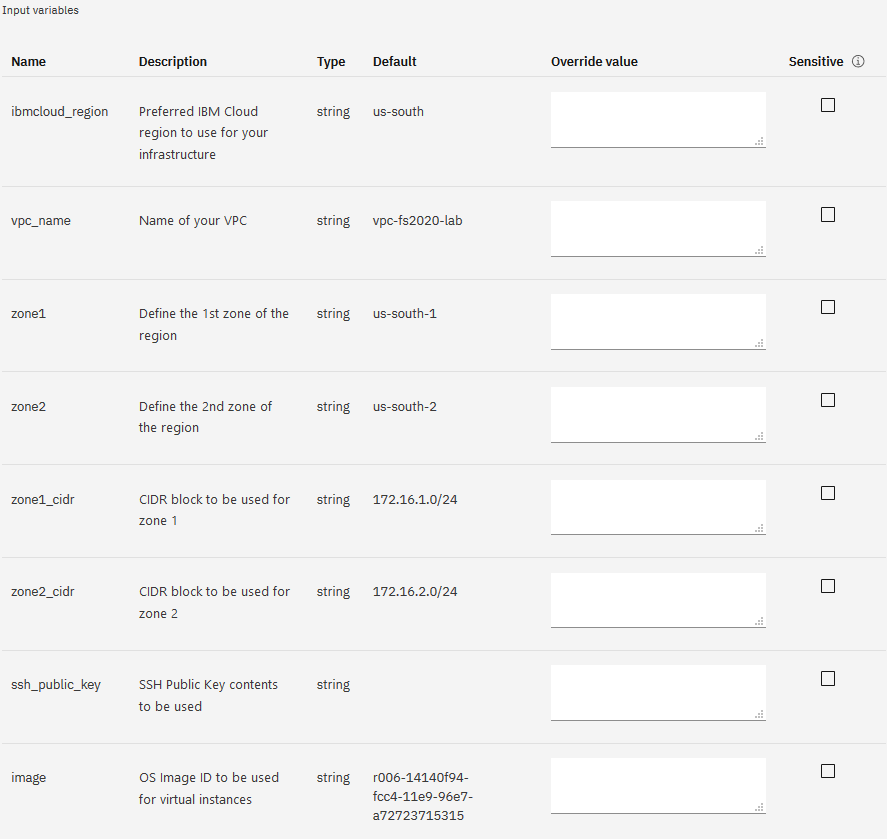
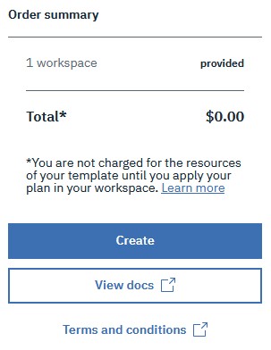

## Exercise 2: Create a new Workspace

A Workspace is the defining environment in which you want to provision within Schematics. The resources defined by the Terraform templates will make up this Workspace. The Terraform templates reside within a GitHub or GitLab repository. For this lab, we will be using this GitHub repository ([https://github.com/ejuelibm/fs2020](https://github.com/ejuelibm/fs2020)) containing the Terraform template files to provision resources. 

1. Login in to your IBM Cloud account via the portal. Navigate to the menu and select [Schematics](https://cloud.ibm.com/schematics).

- Click the  button.
- Provide a Workspace Name.
- Enter any tags in which you would like to specify.
- Select the Resource Group, this can also be reflected in the Plan variables.
- Add a description of your choice.

- Add the Github URL to this lab, or the forked URL from your own repository if you chose to use a fork.
- A personal access token should not be required since this lab uses a public GitHub repository.
- Click the "Retrieve input variables" button.

2. Upon clicking the "Retrieve input variables" button, Schematics will go out to the provided Github URL and retrieve the template files, also extracting out the variables that have been defined. You should now see the variables populated in a table on your screen. Update any variables for the items in which you choose to modify by entering a new value in the "Override value" textbox. Most variables will already have a default value assigned. You will also notice a sensitive checkbox for each variable. You should not need to secure any of these variables, but if you choose this option, the value will be hidden from the UI later.
- **ibmcloud_region** - Select the region in which you want to deploy the VPC into, default set to Dallas
- **vpc_name** - Provide a name for your VPC, this will also be used to prefix some other resources
- **zone1** - Enter the initial Zone to use within your region. default: us-south-1
- **zone2** - Enter a secondary Zone to use within the region. default: us-south-2
- **zone1_cidr** - Provide a valid CIDR block to use for your VPC
- **zone2_cidr** - Provide a valid CIDR block to use for your VPC
- **ssh_public_key** - Enter the contents of your SSH Public key to be used for the Virtual instances
- **image** - Provide the ID of the OS Image you wish to use
- **profile** - Provide the name of the Instance Profile type you wish to provision

<!--
Eric is here -->

Once all of the values have been entered, click the "Create" button to finalize the new Workspace. This will not create any resources at this time. In the next steps we will look at executing the Plan.

