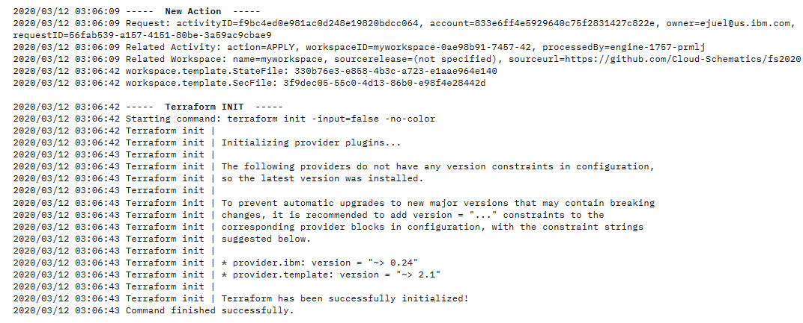

## Exercise 3: Apply the Plan

You now should have a Workspace created. The next step will be to Generate a Plan of your workspace template. Click "Generate plan" to create a Terraform execution plan. No resources will actually be created, but Schematics will go through the process of simulating the resource creation for the plan.

Click on the "View log" link to see the progress of the executing plan. The log will tail as each of the resources go through their steps. When the log completes, you should see a log output stating the number of resources that will be added, changed and destroyed. For this plan, only resources should be added.

Now let's execute the plan to create the resources. Click the "Apply plan" button. Resources should now start provisioning. Like the "Generating Plan" step, you can also view the progress within the "View log" link while resources are being created. If any errors arise, you should see the reason within the log. This initial plan template should not have any issues, so if you have an issue, you may need to check your permissions and credentials.
