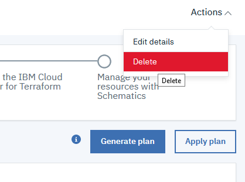

## Exercise 5: Delete Resources and Workspace

In this lab you have successfully built an initial 2 zone environment, attached a load balancer, and optionally learned how to add an additional zone to the plan. To finish up with this lab, all you need to do now is delete your resources. You can also delete the Workspace if you choose to not keep it.

1. Select the "Delete" option in the Action Menu to begin the process.

2. In the popup, select if you wish to remove the workspace or just the resources. Once you have made your selections, click the "Delete" button. This will begin the process of removing resources. Once it is started, you can follow the log to watch the progress of this step and wait for completion. 

